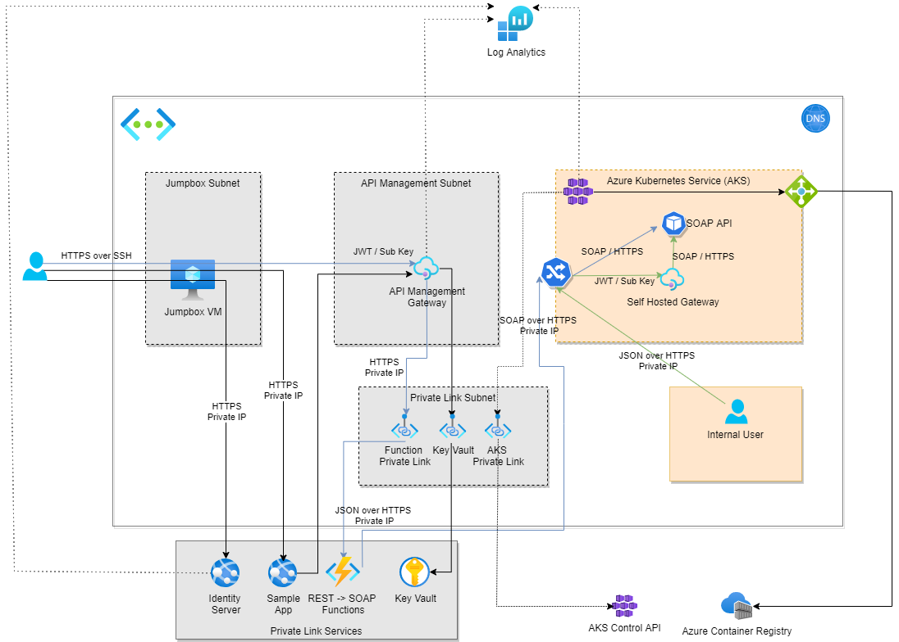
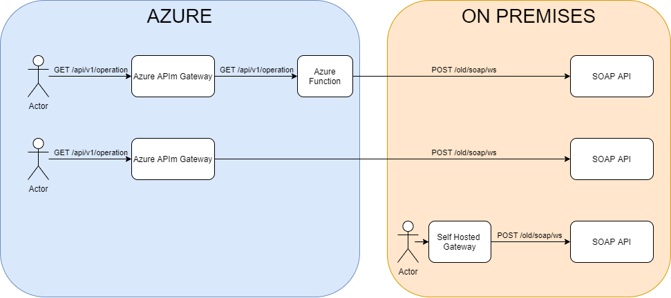

# APIm -> Function -> K8S (hosting legacy API)

This repo provides a sample Azure deployment demonstrating:

 - Azure API Management integrated with KeyVault
 - API Management JWT Bearer validation 
 - API Management Open API Import
 - API Management Self Hosted Gateway
 - Consuming a WS-* SOAP API
 - Private AKS Cluster Deployment
 - NGINX Ingres
 - App Service Plan (Premium tier for Private Link)
 - Logic App (Preview hosted in App Service Plan)
 - Monitoring via Log Analytics 

It optionally deploys
 - An Azure Web Application Firewall with public IP
 - An Azure DevOps agent

It is not production quality. But it can be used to play and poke at a depoyment and to understand how to deploy all of this with Azure ARM templates.

There are Azure DevOps pipelines in the repo to support automated deployment.

## Platform Deployment from local machine

### Deployment with devops agent and WAF
``` \platform\Deploy.ps1 -ResourceGroupName {{resourceGroupName}} -ResourcePrefix {{resourcePrefix}} -Location "{{azure location}}" -ApimPublisherEmail {{azure apim publisher email}} -DevOpsServerUrl {{devops server uri}} -DevOpsServerPAT {{devops personal access token for a build agent}} -WafPfxPath {{waf pfx file}} -WafHostname {{waf hostname}} ```

### Deployment with devops agent
``` \platform\Deploy.ps1 -ResourceGroupName {{resourceGroupName}} -ResourcePrefix {{resourcePrefix}} -Location "{{azure location}}" -ApimPublisherEmail {{azure apim publisher email}} -DevOpsServerUrl {{devops server uri}} -DevOpsServerPAT {{devops personal access token for a build agent}}  ```

### Deployment with WAF
``` \platform\Deploy.ps1 -ResourceGroupName {{resourceGroupName}} -ResourcePrefix {{resourcePrefix}} -Location "{{azure location}}" -ApimPublisherEmail {{azure apim publisher email}} -WafPfxPath {{waf pfx file}} -WafHostname {{waf hostname}}  ```

### Deployment with no Devops Agent and no WAF
``` \platform\Deploy.ps1 -ResourceGroupName {{resourceGroupName}} -ResourcePrefix {{resourcePrefix}} -Location "{{azure location}}" -ApimPublisherEmail {{azure apim publisher email}} ``` 

## Platform Deployment in Azure DevOps

We love trying new features and have used the AKS AAD Authorization feature that, as of the time of writing, is in preview. To register it:

```
#Register the feature against your subscription
az feature register --name EnableAzureRBACPreview  --namespace Microsoft.ContainerService

# Check the status using:
az feature list -o table --query "[?contains(name, 'Microsoft.ContainerService/EnableAzureRBACPreview')].{Name:name,State:properties.state}"

# Wait some time for this to register...
az provider register -n Microsoft.ContainerService
echo This takes a while use this command to check status 
echo az provider show -n Microsoft.ContainerService -otable
```

> If you are updating an existing cluster you will need to register the UpdateAzureRBACPreview feature

### Setup DevOps Library Group

Create a new library group called 'Platform-POC' with the following variables:

| Name | Definition |
| --- | --- |
| Location | Data centre to host in, e.g. Australia East |
| Subscription | ID of the subscription |
| ResourceGroup | Name of the resource group to deploy to |
| ApimPublisherEmail | Email address to associate with Azure Api Management service |
| ResourcePrefix | Simple prefix to help uniquely identify the resource (e.g. grf01) |
| DevopsServerUrl | Url of your devops organisation so we can setup a build agent (e.g. https://dev.azure.com/myorg/) |
| DevopsServerPAT | A DevOps Personal Access Token for setting up the build agent (https://docs.microsoft.com/en-us/azure/devops/pipelines/agents/v2-linux?view=azure-devops) |

### Setup DevOps Service Connections

Create the following Service Connections for ARM deployment that can access the resource-group named above.

| Service Connection Name | Type | Reason |
| --- | --- | --- |
| PoCServiceConnection | Azure Resource Manager | Deploys the resources |

### Deploy DeOps Pipeline

Create an azure pipeline using the ```./platform/platform-deploy-pipeline.yaml``` file, and run the pipeline.

### Get ssh keys for jumpbox, and devops agent

When the platform pipeline has run it will create two ssh keys inside the blob storage container. ```jumpboxSshKey``` gets you into the jumpbox. From there you can jump using ``` devopsAgentSshKey ``` to the DevOps agent.

> TODO - better to put these in KeyVault. Haven't provisioned that service yet though.

### Setup the DevOps agent on the DevOps vm

Install the devops agent onto the Devops Agent machine as described here https://docs.microsoft.com/en-us/azure/devops/pipelines/agents/v2-linux?view=azure-devops


## Sample API Deployment in Azure DevOps

### Step 1

Create a new library group called 'Runtime-POC' with the following variables. These are needed to deploy the APIs and apps that run on the platform.

| Name | Definition |
| --- | --- |
| ImageRepository | Fully qualified name of the private image repository created in Platform deployment (e.g. myacr.azurecr.io) |
| AksApplicationInsightsConnectionString | Connection string to the AKS application insights |
| ApiManagementName | Api Management Resource name |
| FunctionApp | Function App site name |
| IdentityServerApp | Identity Server App Resource name |
| SampleWebApp | Sample Web App site name |
| KeyvaultName | Key Vault name |

### Step 2

Create the following Service Connections to allow Azure Devops pipelines to push to your container registry.

| Service Connection Name | Type | Reason |
| --- | --- | --- |
| PoCAcrServiceConnection | Docker Registry | Pushes the sample API to the private Azure Container Registry |

### Step 3

Create azure pipelines using the following yaml files:
```
./apis/deploy-api.yaml #deploys APIS to AKS
./functions/functions-pipeline.yaml #deploys Identity Server
./identity/identityserver-pipeline.yaml #deploys functions, apis, and the sample web app
``` 
Run the pipelines

> We use Kubernetes RBAC Authorization and a managed identity on the VM to authenticate / authorize kubectl requests. This is currently wired up in a script extension om the devops agent.

## Azure Architecture


## Flows



## References

### API Management
For limitations on SOAP endpoints see [https://docs.microsoft.com/en-us/azure/api-management/api-management-api-import-restrictions](https://docs.microsoft.com/en-us/azure/api-management/api-management-api-import-restrictions)

### SOAP WSDL
We used the dotnet wrapper around svcutil to import wsdl into our .net 5 project ```dotnet tool install --global dotnet-svcutil```
